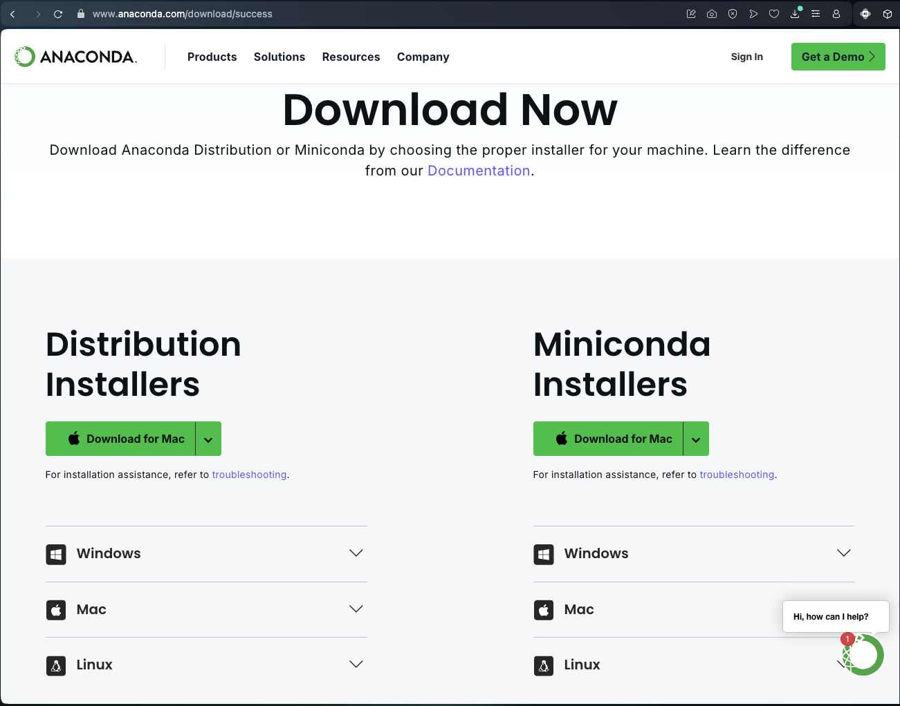

# Step by Step Guide to Set Up Anaconda & UV Environment for Data Science/AI

This is step-by-step tutorial for setting up a Data Science/AI environment using Anaconda and UV Environment. This tutorial is written with easy-to-follow step-by-step explanations.

---

## What is Anaconda and Conda?

**Anaconda** is an open-source distribution for the Python and R programming languages, designed for scientific computing, data analysis, and machine learning. Anaconda simplifies package and environment management and supports over 1,500 ready-to-use data science packages.  

**Conda** is a package and environment manager included in Anaconda. Conda allows users to manage packages and environments efficiently, avoid dependency conflicts, and ensure project consistency.

---

## ❓ Why Do We Need a Virtual Environment?

Virtual environments allow us to:

- Isolate projects: Each project has specific dependencies and package versions without affecting other projects.
- Prevent version conflicts: Avoid issues when two projects require different versions of the same package.
- Reproducibility: Ensure the code runs with consistent dependencies across different systems.

---

## What is UV?

UV is a Python environment management tool that allows you to easily create, manage, and delete virtual environments. Unlike pip and virtualenv, UV integrates environment creation and package installation in a single command, and provides automatic Python version management.

---

## Why Use UV?

- **Speed**: Faster package installation and dependency resolution compared to pip and poetry.
- **Ease of Use**: Simple and intuitive commands for creating and managing environments.
- **Python Version Management**: Ability to manage multiple versions of Python without additional tools.
- **Project Isolation**: Each project can have its own environment and dependencies, avoiding conflicts between projects.

---

## 🐍 Part 1: Installing Anaconda

**1. Download the Anaconda Installer**  
**What**  
The installer file to install Anaconda on your computer.  
**Why**  
Anaconda provides Python and ready-to-use data science packages in one installation.

Steps:
- Go to https://www.anaconda.com/products/distribution
- Choose the version for your OS (Windows/macOS/Linux)
- Click the Download button

Do's:
- Download from the official Anaconda website
- Save the installer in an easily accessible folder  
Don'ts:
- Do not download from unofficial sources
- Do not save in system folders

**2. Run the Anaconda Installer**  
**What**  
The process of installing Anaconda on your system.  
**Why**  
To get Python and all necessary data science packages.

Steps:
- Open the downloaded installer
- Follow the installation wizard
- Choose the “Add Anaconda to PATH” option (optional)

Do's:
- Use default settings if unsure
- Check the PATH option for easier terminal access  
Don'ts:
- Do not change the installation directory to a system folder
- Do not cancel the installation midway

**3. Verify Anaconda Installation**  
**What?**  
This step ensures that Anaconda is properly installed and can be accessed from the terminal.  
**Why?**  
To prevent issues in the next steps when using Conda or Python from Anaconda.

Steps:
1. Open terminal or command prompt
2. Type the command: `conda --version`
3. If the Conda version appears, the installation is successful.

Do's:
- Use a new terminal session after installation to ensure PATH is refreshed
- Make sure the command runs without errors  
Don'ts:
- Don’t ignore errors or missing version output — check the installation again

**4. Configure Conda and Anaconda PATH Variables**  
**What?**  
Configuring PATH variables so the Conda and Python commands can be accessed from any terminal.  
**Why?**  
So you don't have to use Anaconda Navigator or a specific terminal every time.

Steps:
1. On Windows, add Anaconda and Scripts directory to the PATH Environment Variable.
2. On macOS/Linux, this is usually automatic. If not, edit `.bashrc` or `.zshrc`.
3. Press `Windows + R`, type `sysdm.cpl`, press Enter.
4. Go to the “Advanced” tab, click “Environment Variables”.
5. Choose “Path” in “System variables”, click “Edit”.
6. Add the following paths (replace USERNAME):
7. Click OK

Do's:
- Restart terminal after making changes
- Restart computer if necessary  
Don'ts:
- Don’t delete other important PATH entries
- Be careful while editing environment variables

**5. Create a New Conda Environment**  
**What?**  
Creating a new Conda environment means creating a separate workspace for a project.  
**Why?**  
To avoid conflicts between different Python or package versions across projects.

Steps:
- Run the following in terminal: `conda create -n env_name python=3.9`

Do's:
- Use descriptive and easy-to-remember names for environments  
- Avoid unnecessary environment creation  
Don'ts:
- Don’t install all packages in the base environment

---

## 🧪 Part 2: Creating UV Environment

**1. Create a New Environment**  
**What**  
Create an isolated environment for a UV project.  
**Why**  
To prevent dependency conflicts across projects.

Steps:
1. Make sure Conda is deactivated (`conda deactivate`)
2. Type: `pip install uv`
3. A successful output like `Successfully installed uv-0.7.12` indicates success
4. The `ghost_intellixuv` folder will be created during `uv init`. You do not need to create it manually.

Do's:
- Use descriptive environment names
- Use compatible Python versions  
Don'ts:
- Don’t use the base environment for projects
- Don’t create unnecessary environments

**2. Initialize the UV Project**  
**What?**  
Initializing a UV project sets up the directory structure and basic config files.  
**Why?**  
Helps maintain consistency, supports collaboration, and ensures manageable dependencies.

Steps:
1. Ensure UV environment is active  
2. Run:  
   `uv init ghost_intellixuv`  
   `cd ghost_intellixuv`  
3. Output will indicate initialization at `C:\Users\USERNAME\ghost_intellix\ghost_intellixuv`

Do's:
- Use consistent folder structure  
- Document dependencies in `requirements.txt`  
- Create a clear `README.md`  
- Use a virtual environment per project  
Don'ts:
- Don’t mix project files with personal files  
- Don’t forget to add environments to `.gitignore`  
- Don’t store sensitive data in the project folder  
- Don’t change folder structure after setup

**4. Install Required Packages**  
**What?**  
Install the necessary libraries for the UV project.  
**Why?**  
To access the functions needed during development.

Steps:
- Type: `uv add pandas`

Do's:
- Only install needed packages  
- Check for version compatibility  
Don'ts:
- Don’t install packages in base environment  
- Don’t install unknown packages blindly  
- Don’t mix UV and pip commands

**5. Deactivate UV Environment**  
**What?**  
Deactivate UV environment when done.  
**Why?**  
To return to base or default shell.

Steps:
- Type: `.venv\Scripts\deactivate`

Do's:
- Always deactivate when changing contexts  
Don'ts:
- Don’t leave environments active unnecessarily

**6. Conda vs UV Comparison**  
**What?**  
Compare Conda and UV environment management tools.  
**Why?**  
To choose the right tool based on needs.

Details:
- Conda: General-purpose environment and package management across projects  
- UV: Project-specific environment/framework, possibly focused on AI

Do's:
- Use Conda for broader environment control  
- Use UV for focused project setups  
Don'ts:
- Don’t mix configurations without syncing

**7. Recommended Packages for UV Environment**  
Common and recommended packages for data science and machine learning:
- numpy  
- pandas  
- matplotlib  
- scikit-learn  
- jupyter  
- seaborn  
- tensorflow or pytorch (as needed)

Do's:
- Install based on actual project needs  
- Regularly update packages  
Don'ts:
- Don’t install unnecessary or unknown packages

**8. Troubleshooting Guide for Conda and UV**  
Common issues and solutions:

*Issue 1: Conda Command Not Recognized*  
Symptom: `'conda' is not recognized`  
Solution:
- Verify Anaconda installation
- Check PATH variable
- Run `conda init cmd.exe` and restart terminal

*Issue 2: Environment Activation Fails*  
Symptom: `Script execution is disabled`  
Solution:
- Run PowerShell as Administrator  
- Type: `Set-ExecutionPolicy RemoteSigned`  
- Choose "Y"

*Issue 3: Package Installation Fails*  
Symptom: `Could not find a version`  
Solution:
- Update pip: `python -m pip install --upgrade pip`
- Check Python compatibility
- Try different package versions

Do's:
- Always read documentation and error messages  
- Use community forums and Stack Overflow  
Don'ts:
- Don’t ignore error messages  
- Don’t force install without checking

---

## 🔄 Part 3: Environment Management

Important Commands  
Below are some key commands for managing environments:

- `conda create -n myenv python=3.9` — Create a new Conda environment
- `conda activate myenv` — Activate the Conda environment
- `conda deactivate` — Deactivate the current environment
- `conda list` — List installed packages
- `conda env remove -n myenv` — Remove environment

---

## 🎯 Conclusion

Anaconda is like a big city divided into buildings (environments), each with different furniture (packages) tailored to its inhabitants. You, as the user, can enter the right building depending on your task — avoiding interference with others.

By following this guide, you now have:

- Anaconda installed on your system  
- UV environment ready to use  
- Basic knowledge of environment management  

**Happy coding! 🚀**
